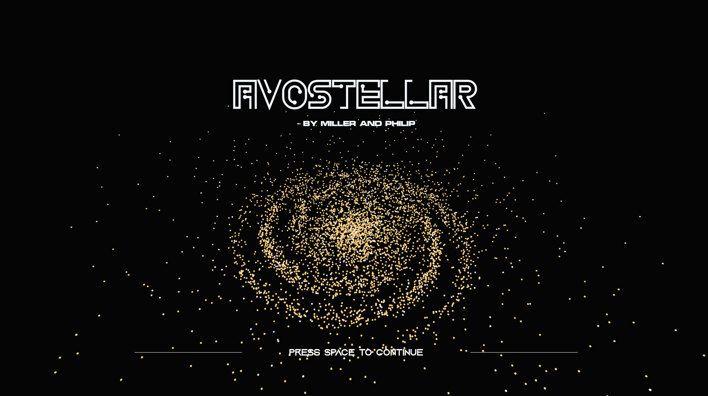

# AvoStellar: A 3D Planet Clicker Game


<div align="center">
    
    <p style="font-size: 15px">
    AvoStellar is a simple 3D planetary cookie clicker game built with Three.js and React. Click away to earn coins, and use coins to purchase upgrades to generate coins faster :)
    </p>
</div>


## Features

- **Planet Clicker Game**: Users can enjoy a relaxing planet clicker game, enabled by [Three.js](https://threejs.org) and [React](https://react.dev).
- **User Login & Sign Up**: Users are able to login (by going to `/login`) and sign up (by going to `/signup`) by entering their email and a password. Basic authentication is done using [Supabase](https://supabase.com/) and notification UI is done using [React Hot Toast](https://react-hot-toast.com).
- **Persistent user session**: Remembering users' progress (number of coins).  
Note: this feature is not completed.

## Getting Started
### 1. Clone the repository
```bash
git clone <repository-url> <your-repo-name>
cd <your-repo-name>
```
### 2. Install dependencies
```bash
npm install
```

### 2. Creating the `.env` file
Create a `.env` file in the root directory of the project if it isn't already present.
<br/>
Create a project on [Supabase](https://supabase.com/dashboard), then add your Supabase URL and Supabase anon key to the `.env` file.
```
REACT_APP_SUPABASE_URL=your-supabase-url-here
REACT_APP_SUPABASE_KEY=your-public-anon-key
```

### 2. Run the App
```bash
npm start
```
